<picture>
  <source media="(prefers-color-scheme: dark)" srcset="assets/header-dark.svg">
  <source media="(prefers-color-scheme: light)" srcset="assets/header-light.svg">
  
</picture>

  
  
  
  
  
  
  
  
  
  
  
  
  
  
  
  

> C#/.NET developer from the Windows side of things: desktop apps (WPF, WinForms), ASP.NET Core backends and whatever lives in process memory.

### 🔭 What I'm into

- 📈 **Trading & markets**: my own portfolio analytics on the T-Invest API (.NET microservices, technical analysis, AI and ML signals, backtests) and strategy research with AI agents. Stocks and crypto.
- 🌐 **VPN & networks**: self-hosted VPN infrastructure on Remnawave and Xray-core, proxies, and automation for VPS fleets.
- 🤖 **Vibe coding & AI**: building with Claude Code and Codex, local LLMs and media generation on my own GPU, small browser games.
- 🎮 **Game internals**: memory research and reverse engineering (Warface, CS:GO, HELLDIVERS 2, Deadlock).

<picture>
  <source media="(prefers-color-scheme: dark)" srcset="https://raw.githubusercontent.com/0xLaileb/0xlaileb/output/stats-dark.svg">
  <source media="(prefers-color-scheme: light)" srcset="https://raw.githubusercontent.com/0xLaileb/0xlaileb/output/stats-light.svg">
  
</picture>

<picture>
  <source media="(prefers-color-scheme: dark)" srcset="https://raw.githubusercontent.com/0xLaileb/0xlaileb/output/snake-dark.svg">
  <source media="(prefers-color-scheme: light)" srcset="https://raw.githubusercontent.com/0xLaileb/0xlaileb/output/snake-light.svg">
  
</picture>

  

